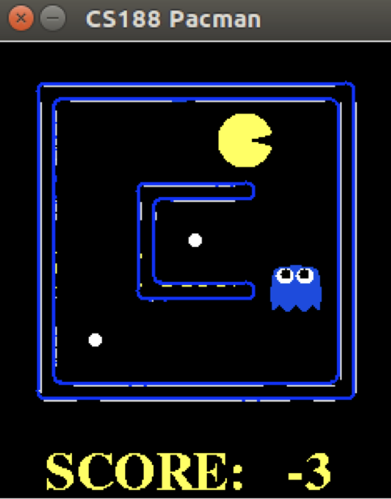

# Pac-Man Q-Learning Agent
<div align="center">
  
</div><br>


Welcome to the Pac-Man Q-Learning Agent repository! This project demonstrates the implementation of a reinforcement learning algorithm, specifically Q-Learning, to enable Pac-Man to learn and navigate its environment. Developed in Python, this project leverages a simplified version of Pac-Man game to illustrate how Q-Learning can be used for decision-making in an AI agent.

## Project Overview

- **Objective**: Implement and evaluate a Q-Learning algorithm for controlling Pac-Man in the classic game.
- **Language**: Python 3
- **Environment**: Pac-Man game framework provided by UC Berkeley's AI course.
- **Algorithm**: Q-Learning, a reinforcement learning technique where the agent learns the value of actions based on rewards received from the environment.

## Key Features

- **Agent**: Pac-Man, controlled by the `QLearnAgent`.
- **Learning**: Pac-Man learns to navigate the game environment, avoid ghosts, and collect food using Q-Learning.
- **Parameters**:
  - `-n`: Number of game iterations to run.
  - `-x`: Number of training episodes.

## Usage

To run the Q-Learning agent for Pac-Man, use the following command:

```sh
python3 pacman.py -p QLearnAgent -x 2000 -n 2010 -l smallGrid
